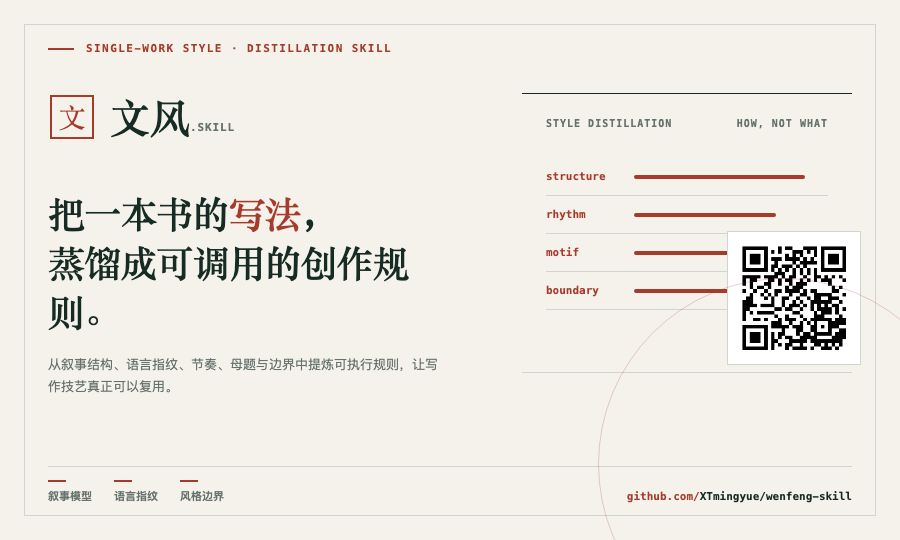
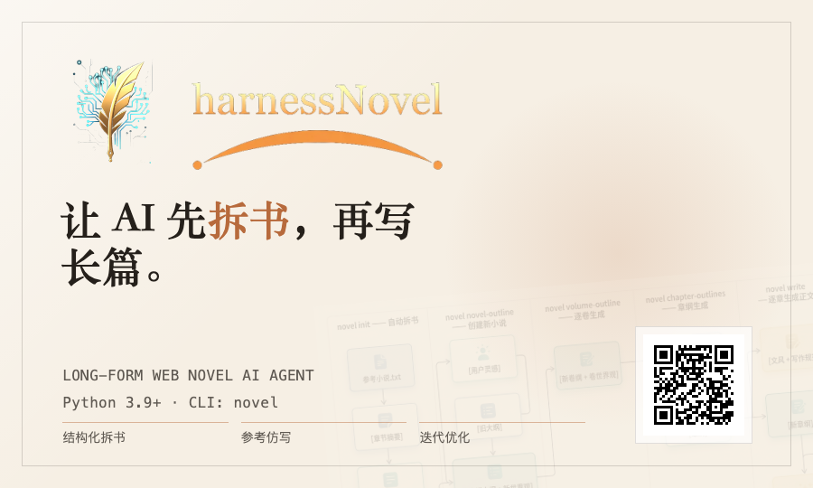

# 你好，我是 XTmingyue

**AI Explorer. Building small tools, workflows, and experiments for human-AI collaboration.**

我正在探索 AI 如何改变个人创造、软件开发和知识生产。

从想法、原型、代码、内容，到自动化系统，尽量让每一次实验都沉淀成可以复用、可以迭代、可以被他人理解的项目。

---

## 我在探索的方向

### AI Native Workflow

一个人如何借助 AI 完成过去需要一个小团队才能完成的事。

- AI 编程与产品原型
- Agent 工作流
- Prompt / Skill / MCP
- 自动化知识管理
- AI 工具链

### Building in Public

我会把真实使用中的想法、脚本、工具和实验整理成开源项目。

不追求一开始就完整，更关注：

- 是否真的解决了我的问题
- 是否能被别人复用
- 是否能继续演化

### Human + AI

我相信 AI 最有价值的地方，不是替代人的判断，而是放大人的判断。

更好的问题、更快的验证、更低成本的试错，才是 AI 给个人创造者带来的真正变化。

---

## 当前项目

### wenfeng-skill

把一本书的写法，蒸馏成可调用的创作规则。

### harnessNovel

让 AI 先拆书，再写长篇。

---

## 我相信的几件事

AI 时代，真正稀缺的不是生成能力，而是判断力。

一个好工具不应该让人变懒，而应该让人更清楚自己想要什么。

探索不是追热点，而是不断把模糊的问题变成可运行的东西。

---

## 找到我

**微信公众号** · [飞鸟onTheWay](https://mp.weixin.qq.com/s/_GIBLfxKKc6VyMdx9oWhwA) 

**社交平台** · [小红书 潮声明月](https://www.xiaohongshu.com/user/profile/5668486ae4251d644618986d)· [知乎 飞鸟在路上](https://www.zhihu.com/people/05124ba329947f0f0b705c0fce66b069)

**Email** · xtmingyue@gmail.com
